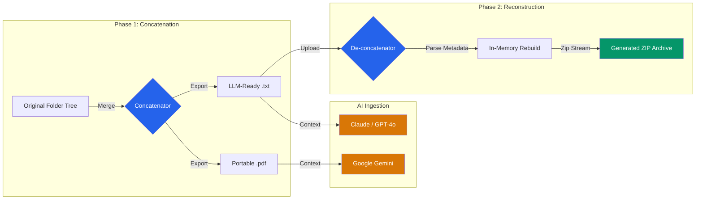
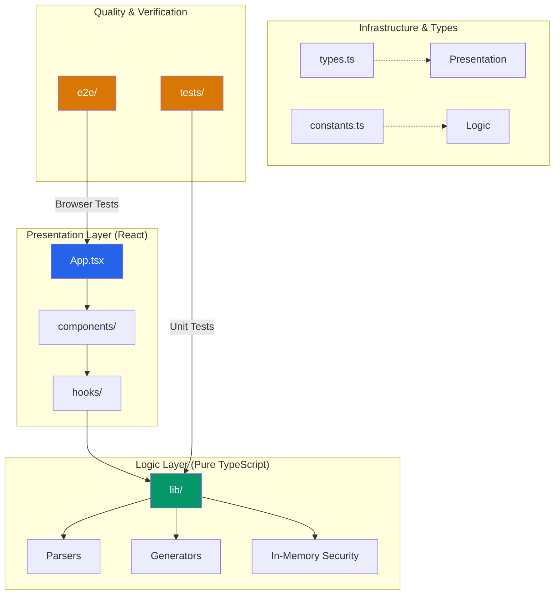

# Concatenator

[](https://github.com/Kolla-Engineering-Labs/concatenator/actions/workflows/ci.yml)
[](https://github.com/Kolla-Engineering-Labs/concatenator/actions/workflows/github-code-scanning/codeql)
[](https://codecov.io/gh/Kolla-Engineering-Labs/concatenator)
[](https://app.codecov.io/gh/Kolla-Engineering-Labs/concatenator/bundles)

A professional, minimalist tool designed to streamline the process of merging multiple source files into a single, well-formatted text document and extracting them back. Concatenator is specifically optimized for developers who need to provide large amounts of context to Large Language Models (LLMs) or manage multi-file codebases in a single view.

## Table of Contents

- [Why Concatenator?](#why-concatenator)
- [Key Features](#key-features)
- [Tech Stack](#tech-stack)
- [Development](#development)
- [Installation & Setup](#installation--setup)
- [Environment Variables](#environment-variables)
- [Usage](#usage)
- [Contribution](#contribution)

### 💡 Why Concatenator?

Developers often struggle to provide full codebase context to LLMs due to file-count limits or token fragmentation. Concatenator streamlines this by bundling your project into a single, parseable file—optimizing context retention while providing a "safety net" to restore your files instantly.

## Key Features

- **Full-Circle File Management**: Merge directory structures into LLM-ready `.txt` or `.pdf` files, with the ability to instantly reconstruct and download the entire file tree as a ZIP archive from a single Concatenator `.txt` file.



- **Multiple Output Formats**:
  - **Text (default)**: Save concatenated files as a plain `.txt` file.
  - **PDF**: Export concatenated files as a formatted PDF document with proper pagination and delimiters.
- **Smart Ignore System**:
  - Exclude common noise (e.g., `node_modules`, `.git`, `package-lock.json`) using simple string matches or powerful Regular Expressions.
  - **Auto-Discovery**: CLI automatically respects `.concatignore` or `.gitignore` in your current working directory.
  - **CLI Persistence**: Use `-i, --ignore-file <path>` to leverage existing project configurations for both bundling and extraction. Syncs between `localStorage` and server-side `.concatenate-ignore` in the web UI.
- **Advanced Visualization**:
  - Switch between **List View** for flat file management and **Tree View** for hierarchical directory inspection.
  - Real-time filtering and sorting (directories first, then alphabetical).
- **Developer-Centric UI**:
  - Drag-and-drop support for folders and files.
  - Dark Mode optimized for long coding sessions.
  - Automatic de-concatenation upon dropping a compatible `.txt` file.
  - Output format toggle (TEXT/PDF) with localStorage persistence.
- **Hardware Safety Guardrails**: Configurable **Max File Limit** (default: 10,000 files) to prevent browser memory exhaustion.
- **Privacy-First File Access**: Uses the **File System Access API** with explicit user control — directory permissions are granted per-session through native browser picker dialogs. No persistent background access.
- **Hidden File Handling**: Hidden files and directories (those starting with `.`) are not automatically excluded. Common hidden items (`.git`, `.env`, `.vscode`, etc.) are pre-configured in the default ignore list. You can add custom patterns to exclude additional hidden files.

> [!WARNING]
> **Hardware Safety**: Dragging massive directories without proper ignore patterns can temporarily freeze the browser thread. Always verify your **Max File Limit** settings before large imports. 🛡️

## Tech Stack

- **Frontend**: [React 19](https://react.dev/), [TypeScript](https://www.typescriptlang.org/), [Tailwind CSS 4](https://tailwindcss.com/)
- **Animations**: [Framer Motion](https://www.framer.com/motion/) (`motion/react`)
- **Icons**: [Lucide React](https://lucide.dev/)
- **Backend**: [Express](https://expressjs.com/) (Node.js)
- **Build Tool**: [Vite 6](https://vitejs.dev/)
- **Utilities**: [JSZip](https://stuk.github.io/jszip/) for archive generation, [jsPDF](https://github.com/parallax/jsPDF) for PDF generation

### 🗺️ Architecture Map



## Development

### Logging

Concatenator uses a lightweight logging utility (`src/lib/logger.ts`) for debugging:

- **Levels**: `debug` < `info` < `error` (higher levels include lower ones)
- **Default**: `info` (logs info and error, suppresses debug)
- **Format**: `[2026-04-13T12:34:56.789Z] [LEVEL] message`

Set `LOG_LEVEL=debug` in your `.env` to see detailed file parsing logs useful for debugging edge cases.

### Running Tests

```bash
# Unit tests
npm test

# E2E tests
npm run test:e2e
```

## Installation & Setup

To run Concatenator locally, ensure you have [Node.js](https://nodejs.org/) installed, then follow these steps:

1. **Clone the repository**:

   ```bash
   git clone https://github.com/Kolla-Engineering-Labs/concatenator.git
   cd concatenator
   ```

2. **Install dependencies**:

   ```bash
   npm install
   ```

3. **Set up environment variables**:
   Create a `.env` file in the root directory (see the [Environment Variables](#environment-variables) section).

4. **Start the development server**:
   ```bash
   npm run dev
   ```
   The app will be available at `http://localhost:3000`.

## Environment Variables

Concatenator uses a hierarchical approach for API key management to ensure flexibility across different environments.

### API Key Handling

**Security Note**: API keys are stored **only in memory** for the current browser session. They are not persisted to `localStorage`, cookies, or any browser storage. This means:

- Keys must be re-entered after each page reload
- Keys are never written to disk in the browser
- Environment variables can still be used for server-side builds

### Configuration

Create a `.env` file in the root directory and add your API keys:

```env
# .env
GEMINI_API_KEY=your_gemini_key
OPENAI_API_KEY=your_openai_key
ANTHROPIC_API_KEY=your_anthropic_key

# Optional: Logging level (debug | info | error)
LOG_LEVEL=info
```

## Usage

### Web Interface

The web UI provides a visual way to concatenate and de-concatenate files with drag-and-drop support.

#### Concatenating Files

1. Ensure the mode is set to **Concatenate**.
2. (Optional) Adjust the **Max Files** dropdown to set a safety limit (500 - 20,000 files, default: 10,000). This prevents browser memory issues when processing large folders.
3. Drag and drop a folder or multiple files into the upload zone.
4. Review the **Selected Files** list. Use the **Ignore List** to filter out unwanted files.
5. Choose your output format using the **TEXT/PDF** toggle at the bottom (TEXT is default).
6. Click **Concatenate & Download**. The output will be a timestamped file (e.g., `concatenator-20260410_123045.txt` or `concatenator-20260410_123045.pdf`).

**Note**: The Max File Limit applies to both import and concatenation. If you attempt to drag-and-drop or concatenate more files than the selected limit, the operation will be halted and a warning displayed to prevent browser crashes.

#### Hidden Files & Dotfiles

By default, **hidden files are included** in imports. The File System Access API returns all directory entries, including those starting with `.`.

**Pre-configured exclusions** (via default ignore list):

- Version control: `.git`
- Environment/config: `.env`, `.vscode`, `.secrets`
- Build artifacts: `.next`, `.gradle`, `.expo`, `.terraform`
- System files: `.DS_Store`
- Cache patterns: `/^\\..*_cache$/` (matches `.pytest_cache`, `.eslint_cache`, etc.)

**To exclude additional hidden files**, add patterns to your ignore list:

- Literal match: `.myconfig` (excludes `.myconfig` file or directory)
- Regex pattern: `/^\\.custom-.*/` (excludes all files starting with `.custom-`)

### De-concatenating Files

1. Switch the mode to **De-concatenate**.
2. Drop a `.txt` file previously generated by this tool into the upload zone.
3. The app will automatically parse the content, reconstruct the directory structure, and prompt you to download a ZIP archive.

#### Error Handling: Partial or Corrupted Files

When an LLM modifies the concatenated file (e.g., hallucinates content, deletes delimiters, or truncates markers), the de-concatenation parser handles these gracefully:

| Scenario                         | Parser Behavior                                              | User Feedback                                                                                |
| -------------------------------- | ------------------------------------------------------------ | -------------------------------------------------------------------------------------------- |
| **Missing `FILE_END_DELIMITER`** | File content is skipped; parser continues to next valid file | Warning displays: "N file(s) were skipped due to missing end markers: file1.js, file2.js..." |
| **Missing `START_DELIMITER`**    | Content ignored until next valid start marker                | No specific warning; file simply not extracted                                               |
| **Truncated file content**       | Only content before the next start/end marker is considered  | May result in partial file extraction or skipping                                            |

**Example Warning Message:**

```
Warning: 3 file(s) were skipped due to missing end markers: src/utils.js, src/config.js, src/types.ts. Check the console for details.
```

The parser is designed to be **fault-tolerant**: valid files are always extracted even if others in the same bundle are corrupted. Check the browser console for a complete list of skipped files with their paths.

### CLI (Command Line Interface)

Concatenator also provides a professional CLI for automation and scripting workflows.

#### Installation

Link the CLI globally for system-wide access:

```bash
npm link
```

Or use the development script from the project directory:

```bash
npm run dev:cli -- [command] [options]
```

#### Commands

**`concat <path>`** - Bundle a directory into a single LLM-ready file

```bash
# Output to stdout (default)
concatenator concat ./src

# Output to file
concatenator concat -o context.txt ./src

# With verbose logging and exclusions
concatenator concat -o context.txt -v -e node_modules,dist ./src
```

Options:

- `-o, --output <file>` - Specify output filename (default: stdout)
- `-e, --exclude <patterns>` - Additional patterns to ignore (comma-separated)
- `-i, --ignore-file <path>` - Path to an ignore file (.concatignore, .gitignore, etc.)
- `-v, --verbose` - Show detailed file processing logs
- `-f, --force` - Overwrite existing files without prompting

**`extract <file>`** - Reconstruct a project from a concatenated file

```bash
# Extract to directory (default)
concatenator extract -o ./restored bundle.txt

# Extract as ZIP archive
concatenator extract --zip -o restored.zip bundle.txt

# Validate without extracting (dry-run)
concatenator extract --dry-run bundle.txt

# With verbose output
concatenator extract -v -o ./restored bundle.txt

# Dry-run with very verbose output (shows all foreign markers)
concatenator extract --dry-run -vv bundle.txt
```

Options:

- `-o, --output <dir>` - Destination directory (default: `.`)
- `-e, --exclude <patterns>` - Patterns to ignore during extraction (comma-separated)
- `-i, --ignore-file <path>` - Path to an ignore file to use during extraction
- `-z, --zip` - Output as a .zip archive instead of writing to disk
- `-d, --dry-run` - Validate integrity without extracting
- `-v, --verbose` - Show detailed file processing logs
- `-vv` - Very verbose (shows all foreign markers in dry-run mode)
- `-f, --force` - Overwrite existing files without prompting

**`validate <file>`** - Check the integrity of a concatenated file

```bash
concatenator validate bundle.txt

# With verbose output
concatenator validate bundle.txt -v

# Very verbose (shows all foreign markers)
concatenator validate -vv bundle.txt
```

Options:

- `-v, --verbose` - Show detailed validation logs
- `-vv` - Very verbose (shows all foreign markers and detailed breakdown)

Validates session ID consistency, marker balance, and file structure. Exits with code 0 on success, 1 on failure.

#### Global Options

- `-V, --version` - Output the version number
- `-h, --help` - Display help for command

#### Examples

```bash
# Concatenate directory to file
concatenator concat -o context.txt ./src

# Concatenate with exclusions
concatenator concat -o output.txt -e node_modules,dist ./project

# Extract and restore files
concatenator extract -o ./restored bundle.txt

# Extract as ZIP archive
concatenator extract --zip -o backup.zip bundle.txt

# Validate file integrity
concatenator validate bundle.txt
```

## Contribution

This project is maintained by the **Kolla-Engineering-Labs** team.

We welcome contributions! Please see our [Contributing Guide](./CONTRIBUTING.md) for detailed setup instructions, our testing stack (Vitest + Playwright), and PR process using [Conventional Commits](https://www.conventionalcommits.org/).

- **Quick Start**: Get running in 3 minutes with our [Quickstart Guide](./QUICKSTART.md)
- **Reporting Bugs**: Use GitHub Issues with our [bug report template](https://github.com/Kolla-Engineering-Labs/concatenator/issues/new?template=bug_report.md)
- **Security Issues**: Report privately via [Security](./SECURITY.md) — never via public issues
- **Submitting PRs**: Use branch naming like `feat/description` or `fix/description` following [Conventional Commits](https://www.conventionalcommits.org/en/v1.0.0/#summary) format

---

© 2026 Kolla-Engineering-Labs. All rights reserved.
