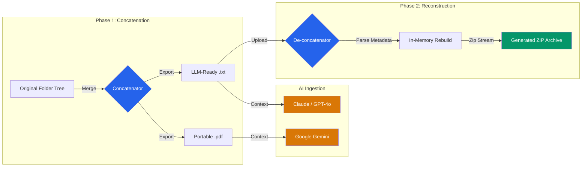
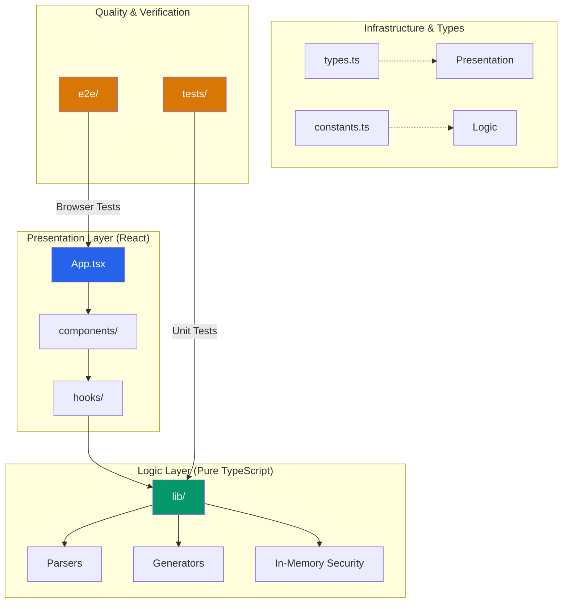

# Concatenator

[](https://github.com/Kolla-Engineering-Labs/concatenator/actions/workflows/release.yml)
[](https://github.com/Kolla-Engineering-Labs/concatenator/actions/workflows/release-sea-binaries.yml)
[](https://github.com/Kolla-Engineering-Labs/concatenator/actions/workflows/ci.yml)
[](https://github.com/Kolla-Engineering-Labs/concatenator/actions/workflows/e2e.yml)
[](https://github.com/Kolla-Engineering-Labs/concatenator/actions/workflows/github-code-scanning/codeql)
[](https://codecov.io/gh/Kolla-Engineering-Labs/concatenator)
[](https://app.codecov.io/gh/Kolla-Engineering-Labs/concatenator/bundles)

A professional, minimalist tool designed to streamline the process of merging multiple source files into a single, well-formatted text document and extracting them back. Concatenator is specifically optimized for developers who need to provide large amounts of context to Large Language Models (LLMs) or manage multi-file codebases in a single view.

## Table of Contents

- [Why Concatenator?](#why-concatenator)
- [Key Features](#key-features)
- [Tech Stack](#tech-stack)
- [Development](#development)
- [Installation & Setup](#installation--setup)
- [Environment Variables](#environment-variables)
- [Usage](#usage)
- [Contribution](#contribution)

### 💡 Why Concatenator?

Developers often struggle to provide full codebase context to LLMs due to file-count limits or token fragmentation. Concatenator streamlines this by bundling your project into a single, parseable file—optimizing context retention while providing a "safety net" to restore your files instantly.

## Key Features

- **Full-Circle File Management**: Merge directory structures into LLM-ready `.txt` or `.pdf` files, with the ability to instantly reconstruct and download the entire file tree as a ZIP archive from a single Concatenator `.txt` file.



- **Multiple Output Formats**:
  - **Text (default)**: Save concatenated files as a plain `.txt` file.
  - **PDF**: Export concatenated files as a formatted PDF document with proper pagination and delimiters.
- **Smart Ignore System**:
  - Exclude common noise (e.g., `node_modules`, `.git`, `package-lock.json`) using simple string matches or powerful Regular Expressions.
  - **Discovery-First Traversal**: The core engine now prioritizes negations (e.g., `!core`). Files matching a negation pattern are discovered and included even if they reside within an ignored directory (e.g., `tests/`), ensuring complete visibility for "exception" files.
  - **Heavy Directory Traversal Hardening**: To prevent catastrophic traversal times and event-loop lockups when scanning enormous dependency or build folders, unanchored negated patterns (e.g., `!core`) are **explicitly bypassed** inside heavy common directories (including `node_modules`, `.git`, `.next`, `.expo`, `.gradle`, `.terraform`, `.vagrant`, `bower_components`, `playwright-report`, `test-results`, `venv`, and `vendor`).
  - **Anchored Negation Exceptions**: If you explicitly need to target and discover an exception file/folder inside a heavy ignored folder, you must use an **anchored negated pattern** (e.g., `!node_modules/core`), which allows the recursive engine to directly target the folder without wasting resources scanning the entire parent tree.
  - **Right-Click Context Menu**: Right-clicking any ignored file row in the Workbench table opens a contextual menu allowing developers to **"Include this specific file"** via an automatic path-level negation override (`!path/to/file`) or **"Disable rule: [matchedRule]"** to suspend default/glob rules locally.
  - **Auto-Discovery**: CLI automatically respects `.concatignore` or `.gitignore` in your current working directory.
  - **CLI Persistence**: Use `-i, --ignore-file <path>` to leverage existing project configurations for both bundling and extraction.
  - **Web Auto-Save**: Toggle the **"Auto-Save to .concatenate-ignore"** option in the UI to keep your local workspace in sync with your project's ignore configuration automatically.
- **File Status Indicators & Rule Management**:
  - The Workbench uses visual badges to clarify how ignore rules are applied:
    - **Ignored**: Explicitly matches a pattern in your ignore list.
    - **Negated**: Re-included via a negation pattern (prefixed with `!`).
    - **Inherited**: Automatically excluded because a parent directory is ignored.
    - **Negated + Inherited**: A powerful hybrid state indicating an "exception" file that is included even though its containing folder is ignored.
  - Each ignored row also renders an inline **reason badge** (e.g., `node_modules (default)`) derived from the `IgnoreSource` metadata. The badge suffix/tooltip disambiguates the ignore trigger:
    - `(default)` — applied by a built-in engine default (e.g. `node_modules`, `.git`).
    - `(file)` — applied by a `.concatenate-ignore` or `.gitignore` rule.
    - `(session)` — applied by a pattern added in the current workbench session.
    - `(manual override)` — applied when an individual file is manually toggled/ignored via the inline eye icon.
  - **Ignore Files Pill & Rule Suspension**: The **"Ignore Files"** pill component displays both active ignore patterns and locally suspended rules. Suspended rules (disabled via context menu or rule toggles) are visually highlighted with a restore icon (`RotateCcw`), enabling quick re-enabling or fine-grained rule tuning.
- **Structural Redundancy Fixes**:
  - **Root Pruning (Web)**: Automatically reconciles overlapping folder drops. If you drop a parent folder after a child, the workbench "absorbs" the child into the new structure and provides visual feedback via the **Absorption Toast**.
  - **Input Pruning (CLI)**: Normalizes and filters overlapping command-line arguments. If both `./src` and `./src/components` are passed, the redundant sub-path is automatically pruned.
- **High-Velocity Directory Ingestion**:
  - **Concurrency Throttling**: Intelligent parallel discovery (batches of 20) ensures rapid folder scanning without overwhelming the browser's file handle pool.
  - **Incremental & Eager Reading**: Eagerly consumes file content immediately during traversal to prevent handle staleness and `InvalidStateError` during massive 1,000+ file imports on Windows systems.
  - **Aggressive Time-Based Yielding**: During folder drops and processing, the ingestion engine yields control back to the browser's main thread every 30ms (targeting a 30 FPS responsiveness rate). This keeps the UI, text entry, and page layouts fluid and responsive even during massive multi-thousand file crawls.
  - **Throttled Progress UI Updates**: React state updates for the import progress are throttled to 100ms intervals, avoiding React re-rendering bottlenecks.
  - **Incremental Size-Sorted Processing**: Files are sorted by size (smallest first) during import. When ignore rules are edited mid-import, the largest files (processed last) pick up the new rule, bypassing expensive reading entirely.
  - **Memory Safety Guardrails**: Hard limits are enforced during live scans (default: 10,000 files). Exceeding this limit immediately aborts the crawl early to prevent browser memory exhaustion.
  - **Deduplicated Directory Appends**: Prevents redundant folder entry nodes by validating directory existence against the active Virtual File System prior to insertion.
  - **Reserved Name Safety**: Automatically skips reserved Windows system filenames (`NUL`, `CON`, `PRN`, etc.) to guarantee a crash-free experience on all platforms.
  - **Isolated Error Recovery**: Each file operation is self-contained; if one file fails due to OS-level locks, the import continues for the rest of the tree.
- **Root Pruning & Absorption Toast**:
  - **Reconciliation on Drop**: When files or folders are added, the ingestion pipeline reconciles new entries against the existing workbench. It detects if a newly-dropped directory is an ancestor of already-loaded entries or if previously-loaded sub-folders should be absorbed into a wider parent drop.
  - **Absorption Toast**: A non-blocking notification appears whenever files are merged or absorbed, providing clear feedback on how your workbench was reorganized.
  - **Minimum Common Root**: The Tree View automatically collapses single-child intermediate directories to ensure the displayed root always begins at the deepest common ancestor.
- **Precise Token Analytics**:
  - **Modern BPE Standard**: Real-time token counting using the **Tiktoken (BPE)** standard (`o200k_base`), matching GPT-4o and modern coding assistants, with automatic fallback to `cl100k_base` if unavailable.
  - **Performance-Optimized Hybrid Tokenization**:
    - **CPU Exhaustion Prevention & Bypassing**: Binary files (detected via extensions like `.zip`, `.tar`, `.exe`, `.so`, `.png`, `.jpg`, `.pdf`, etc.) and files larger than 500KB completely bypass the Web Worker BPE Tiktoken parser.
    - **Fast Heuristic Mode**: These bypassed files fall back to an instantaneous, non-blocking heuristic (`Math.ceil(char count / 4)`). This provides highly accurate estimates for log dumps, database files, and media, without freezing the browser or Web Worker CPU.
    - **Atomic 500ms Response Batching**: Web Worker results are batched every 500ms before React state commits, preventing high-frequency tree-rebuilding cycles from locking the UI thread.
    - **Backtracking Protection**: The Web Worker tokenization divides large text inputs into 50KB chunks, preventing the Tiktoken RegExp engine from encountering catastrophic backtracking and lowering peak memory usage.
    - **O(1) Sampled Content Hashing**: The cache system uses a sampling approach for strings exceeding 3,000 characters (hashing only the first, middle, and last 1000 characters) to keep cache-key creation extremely fast ($O(1)$) and prevent main-thread freeze-ups.
  - **Efficiency Metrics**: Automatically calculates "Context Gained" through BPE boundary optimization during concatenation.
  - **Budget Guard**: Set token budgets in the CLI to receive warnings when bundles exceed target limits.
- **Workbench Context & Quick Look**:
  - Switch between **List View** for flat file management and **Tree View** for hierarchical directory inspection.
  - **Path Normalization**: The Tree View automatically calculates the **Minimum Common Root**, ensuring your project structure starts at the most relevant shared directory rather than a generic root.
  - **Quick Look**: High-fidelity, instant preview for code, PDFs, and vector assets (SVGs) directly in the browser.
  - Real-time filtering and sorting (directories first, then alphabetical).
- **Developer-Centric UI**:
  - Drag-and-drop support for folders and files.
  - Dark Mode optimized for long coding sessions.
  - Automatic de-concatenation upon dropping a compatible `.txt` file.
  - Output format toggle (TEXT/PDF) with localStorage persistence.
  - **Server Heartbeat Indicator**: a live status dot in the bottom bar shows CLI backend health at a glance — gray while checking, green when connected, amber when unreachable — with context-aware labels ("No server" vs "Reconnecting…").
  - **Stability & Performance**:
    - **Incremental Reading**: File content is read immediately during discovery to prevent handle staleness on Windows.
    - **Concurrency Throttling**: Parallel directory discovery is limited to 20 operations to avoid OS handle exhaustion.
    - **Modern File APIs**: Utilizes `File.text()` and `File.arrayBuffer()` for maximum performance.
    - **Reserved Name Safety**: Automatically skips reserved Windows system names (`NUL`, `CON`, etc.) to prevent browser-level crashes.
- **Hybrid SEA Architecture**: Run Concatenator as a high-performance, single standalone executable (SEA) that embeds the full Web UI. Perfect for air-gapped environments or simplified distribution.
- **Security Hardening**:
  - **Verification**: Built-in `verify` command to check binary integrity against GPG-signed manifests.
  - **Security Center**: In-app transparency showing build hashes and architect fingerprints.
  - **Zero-Trust Token Auth**: Local Workbench server is protected by a unique API token (`CONCATENATOR_API_TOKEN`) to prevent CSRF and unauthorized LAN access.
  - **Code Signing**: All official binaries are signed for Windows (`signtool`) and macOS (`codesign`). For non-certified macOS builds, we provide [ad-hoc signing documentation](./docs/MACOS_SECURITY.md).
- **Release Auditing**: Integrated `test:release` script to perform dry-run audits of release candidates, verifying PGP signatures and SHA256 integrity before distribution.
- **Privacy-First Analytics**: Lightweight usage tracking via **PostHog** to help us improve the tool. All data is collected using privacy-preserving, anonymous profiles.

## Hardware Support

- **Adaptive Touch Input**: The Drop Zone dynamically adapts to touch-primary devices (tablets, mobile). On these devices, the zone acts as a direct trigger for the native OS file picker, allowing seamless browsing of local storage and cloud providers like iCloud or Google Drive.
- **Hardware Safety Guardrails**: Configurable **Max File Limit** (default: 10,000 files) to prevent browser memory exhaustion.
- **Privacy-First File Access**: Uses the **File System Access API** with explicit user control — directory permissions are granted per-session through native browser picker dialogs. No persistent background access.
- **Hidden File Handling**: Hidden files and directories (those starting with `.`) are not automatically excluded. Common hidden items (`.git`, `.env`, `.vscode`, etc.) are pre-configured in the default ignore list. You can add custom patterns to exclude additional hidden files.

> [!WARNING]
> **Hardware Safety**: Dragging massive directories (326+ files) is now optimized with concurrency throttling and eager reading to prevent browser thread freezing. However, always verify your **Max File Limit** settings before importing extremely large corporate monorepos. 🛡️

## Tech Stack

- **Frontend**: [React 19](https://react.dev/), [TypeScript](https://www.typescriptlang.org/), [Tailwind CSS 4](https://tailwindcss.com/)
- **Animations**: [Motion](https://motion.dev/) (`motion/react`)
- **Icons**: [Lucide React](https://lucide.dev/)
- **Backend**: [Express](https://expressjs.com/) (Node.js 22+)
- **Build Tool**: [Vite 6](https://vitejs.dev/)
- **Glob Matching**: [picomatch](https://github.com/micromatch/picomatch) (ESM-native, zero-dependency glob/path matcher powering `IgnoreEngine`)
- **Utilities**: [JSZip](https://stuk.github.io/jszip/) for archive generation, [jsPDF](https://github.com/parallax/jsPDF) for PDF generation

### 🗺️ Architecture Map



## Development

### Logging

Concatenator uses a lightweight logging utility (`src/lib/logger.ts`) for debugging:

- **Levels**: `debug` < `info` < `error` (higher levels include lower ones)
- **Default**: `info` (logs info and error, suppresses debug)
- **Format**: `[2026-04-13T12:34:56.789Z] [LEVEL] message`

Set `LOG_LEVEL=debug` in your `.env` to see detailed file parsing logs useful for debugging edge cases.

### Running Tests

```bash
# Unit tests
npm test

# E2E tests
npm run test:e2e

# Release Candidate Audit (GPG + SHA256)
npm run test:release
```

## Installation & Setup

To run Concatenator locally, ensure you have [Node.js](https://nodejs.org/) installed, then follow these steps:

1. **Clone the repository**:

   ```bash
   git clone https://github.com/Kolla-Engineering-Labs/concatenator.git
   cd concatenator
   ```

2. **Install dependencies**:

   ```bash
   npm install
   ```

3. **Set up environment variables**:
   Create a `.env` file in the root directory (see the [Environment Variables](#environment-variables) section).

4. **Start the development server**:
   ```bash
   npm run dev
   ```
   The app will be available at `http://localhost:5173`.

## Environment Variables

Concatenator uses a hierarchical approach for API key management to ensure flexibility across different environments.

- Environment variables can still be used for server-side builds

### Configuration

Create a `.env` file in the root directory and add your API keys:

```env
# .env
# Logging level (debug | info | error)
LOG_LEVEL=info

# PostHog Analytics
VITE_PUBLIC_POSTHOG_KEY=your_posthog_key
VITE_PUBLIC_POSTHOG_HOST=https://us.i.posthog.com

# API Security Token — protect local API endpoints from bots/LAN probing.
# Generate with: node -e "console.log(require('crypto').randomBytes(32).toString('hex'))"
CONCATENATOR_API_TOKEN=your_secret_token_here
```

## Usage

### Web Interface

The web UI provides a visual way to concatenate and de-concatenate files with drag-and-drop support.

#### Concatenating Files

1. Ensure the mode is set to **Concatenate**.
2. (Optional) Adjust the **Max Files** dropdown to set a safety limit (500 - 20,000 files, default: 10,000). This prevents browser memory issues when processing large folders.
3. Drag and drop a folder or multiple files into the upload zone.
4. Review the **Selected Files** list. Use the **Ignore List** to filter out unwanted files.
5. Choose your output format using the **TEXT/PDF** toggle at the bottom (TEXT is default).
6. Click **Concatenate & Download**. The output will be a timestamped file (e.g., `concatenator-20260410_123045.txt` or `concatenator-20260410_123045.pdf`).

**Note**: The Max File Limit applies to both import and concatenation. If you attempt to drag-and-drop or concatenate more files than the selected limit, the operation will be halted and a warning displayed to prevent browser crashes.

#### Hidden Files & Dotfiles

By default, **hidden files are included** in imports. The File System Access API returns all directory entries, including those starting with `.`.

**Pre-configured exclusions** (via default ignore list):

- Version control: `.git`
- Environment/config: `.env`, `.vscode`, `.secrets`
- Build artifacts: `.next`, `.gradle`, `.expo`, `.terraform`
- System files: `.DS_Store`
- Cache patterns: `/^\..*_cache$/` (matches `.pytest_cache`, `.eslint_cache`, etc.)

**To exclude additional hidden files**, add patterns to your ignore list:

- Literal match: `.myconfig` (excludes `.myconfig` file or directory)
- Regex pattern: `/^\.custom-.*/` (excludes all files starting with `.custom-`)

### De-concatenating Files

1. Switch the mode to **De-concatenate**.
2. Drop a `.txt` file previously generated by this tool into the upload zone.
3. The app will automatically parse the content, reconstruct the directory structure, and prompt you to download a ZIP archive.

#### Error Handling: Partial or Corrupted Files

When an LLM modifies the concatenated file (e.g., hallucinates content, deletes delimiters, or truncates markers), the de-concatenation parser handles these gracefully:

| Scenario                         | Parser Behavior                                              | User Feedback                                                                                |
| -------------------------------- | ------------------------------------------------------------ | -------------------------------------------------------------------------------------------- |
| **Missing `FILE_END_DELIMITER`** | File content is skipped; parser continues to next valid file | Warning displays: "N file(s) were skipped due to missing end markers: file1.js, file2.js..." |
| **Missing `START_DELIMITER`**    | Content ignored until next valid start marker                | No specific warning; file simply not extracted                                               |
| **Truncated file content**       | Only content before the next start/end marker is considered  | May result in partial file extraction or skipping                                            |

**Example Warning Message:**

```
Warning: 3 file(s) were skipped due to missing end markers: src/utils.js, src/config.js, src/types.ts. Check the console for details.
```

The parser is designed to be **fault-tolerant**: valid files are always extracted even if others in the same bundle are corrupted. Check the browser console for a complete list of skipped files with their paths.

### CLI (Command Line Interface)

Concatenator also provides a professional CLI for automation and scripting workflows.

#### Installation

Link the CLI globally for system-wide access:

```bash
npm link
```

Or use the development script from the project directory:

```bash
npm run dev:cli -- [command] [options]
```

#### Standalone Executable

You can compile Concatenator into a single standalone executable (SEA) for Windows, macOS, or Linux. This binary embeds the full Node.js runtime and the Web Workbench assets:

```bash
# Build for your current platform
npm run build:sea
```

The generated executable will be available in `dist/sea/`.

#### Automated Multi-Job Matrix Release Pipeline

On tagging a new release (`v*`), our GitHub Actions workflow ([`.github/workflows/release-sea-binaries.yml`](.github/workflows/release-sea-binaries.yml)) executes a 2-stage multi-job matrix pipeline:

1. **Job 1 (Build Matrix)**: Compiles native SEA binaries in parallel on `ubuntu-latest`, `macos-latest`, and `windows-latest` (`npm run build:sea`) and uploads platform artifacts (`concatenator-linux-x64`, `concatenator-macos-x64`, `concatenator-windows-x64.exe`).
2. **Job 2 (Publish & Cryptographic Signing)**: Downloads all platform binaries into `dist/sea/`, generates a `SHA256SUMS` manifest, attaches a GPG detached ASCII armor signature (`SHA256SUMS.asc`), and publishes all release assets directly to GitHub Releases via `gh release`.

#### Distribution Structure

Concatenator follows a versioned distribution pattern to ensure reliable deployments:

```
dist/
└── sea/
    ├── concatenator-linux-x64        (Linux SEA Binary)
    ├── concatenator-macos-x64        (macOS SEA Binary)
    ├── concatenator-windows-x64.exe  (Windows SEA Binary)
    ├── SHA256SUMS                    (Checksum Manifest)
    └── SHA256SUMS.asc                (GPG Detached Signature)
```

#### Commands

**`ui [path]`** - Launch the web-based Workbench UI for a specific directory

```bash
# Open UI in current directory
concatenator ui

# Open UI for a specific project
concatenator ui ./my-project

# Launch with custom file limits and ignore rules
concatenator ui --max-files 5000 --ignore-file .gitignore ./src
```

Options:

- `-m, --max-files <number>` - Preset the maximum file limit (overrides default 10,000)
- `-i, --ignore-file <file>` - Specify a custom ignore file to use in the Workbench

**`start [path]`** - Launch the Workbench UI with an automated macOS security check

```bash
# Recommended entry point for macOS users
concatenator start ./src
```

Options: Same as `ui`.

**`concat <paths...>`** - Bundle one or more directories/files into a single LLM-ready file

```bash
# Output to stdout (default)
concatenator concat ./src

# Output to file
concatenator concat -o context.txt ./src

# With verbose logging and exclusions
concatenator concat -o context.txt -v -e node_modules,dist ./src

# Multiple entry points (with automatic input pruning)
concatenator concat -o bundle.txt ./src ./lib ./src/components
```

Options:

- `-o, --output <file>` - Specify output filename (default: stdout)
- `-e, --exclude <patterns>` - Additional patterns to ignore (comma-separated)
- `-i, --ignore-file <path>` - Path to an ignore file (.concatignore, .gitignore, etc.)
- `-v, --verbose` - Verbosity level (-v: dir-level tokens, -vv: file-level tokens)
- `--max-tokens <number>` - Budget guard: warn if the precise token count is exceeded
- `-f, --force` - Overwrite existing files or directories without prompting
- `--follow-symlinks` - Follow symbolic links during traversal (CAUTION: may cause infinite loops)
- `-q, --quiet` - Suppress all logging output
- `--pulse` - Mirror pulse data to stderr for headless CI environments

**`extract <file>`** - Reconstruct a project from a concatenated file

```bash
# Extract to directory (default)
concatenator extract -o ./restored bundle.txt

# Extract as ZIP archive
concatenator extract --zip -o restored.zip bundle.txt

# Validate without extracting (dry-run)
concatenator extract --dry-run bundle.txt

# With verbose output
concatenator extract -v -o ./restored bundle.txt

# Dry-run with very verbose output (shows all foreign markers)
concatenator extract --dry-run -vv bundle.txt
```

Options:

- `-o, --output <dir>` - Destination directory (default: `.`)
- `-e, --exclude <patterns>` - Patterns to ignore during extraction (comma-separated)
- `-i, --ignore-file <path>` - Path to an ignore file to use during extraction
- `-z, --zip` - Output as a .zip archive instead of writing to disk
- `-d, --dry-run` - Validate integrity without extracting
- `-v, --verbose` - Show detailed file processing logs
- `-f, --force` - Overwrite existing files or directories without prompting
- `-q, --quiet` - Suppress all logging output
- `--pulse` - Mirror pulse data to stderr for headless CI environments

**`validate <paths...>`** - Check file integrity or perform a pre-flight dry-run on directories

```bash
# Validate a concatenated file
concatenator validate bundle.txt

# Pre-flight directory check (shows file counts and token estimates)
concatenator validate ./src --tokens

# With verbose output
concatenator validate bundle.txt -v

# Very verbose (shows all foreign markers)
concatenator validate -vv bundle.txt
```

Options:

- `-t, --tokens` - Show individual token counts for all files (directory mode)
- `-v, --verbose` - Show detailed validation logs
- `-vv` - Very verbose (shows all foreign markers and detailed breakdown)
- `-e, --exclude <patterns>` - Patterns to ignore during pre-flight check
- `-i, --ignore-file <path>` - Ignore file to use during pre-flight check
- `-q, --quiet` - Suppress all logging output

Validates session ID consistency, marker balance, and file structure. Exits with code 0 on success, 1 on failure.

**`verify [target]`** - Verify binary integrity against a GPG-signed manifest

```bash
# Verify the current running binary (default)
concatenator verify

# Verify a specific binary
concatenator verify ./path/to/concatenator

# Using a local manifest
concatenator verify --manifest ./SHA256SUMS.asc
```

Options:

- `-m, --manifest <path>` - Explicit path to the `SHA256SUMS.asc` manifest file

Performs a hash-level comparison against the official manifest and checks for the architect's GPG public key in the local keychain.

#### Global Options

- `-V, --version` - Output the version number
- `-h, --help` - Display help for command

#### Examples

```bash
# Concatenate directory to file
concatenator concat -o context.txt ./src

# Concatenate with exclusions
concatenator concat -o output.txt -e node_modules,dist ./project

# Extract and restore files
concatenator extract -o ./restored bundle.txt

# Extract as ZIP archive
concatenator extract --zip -o backup.zip bundle.txt

# Validate file integrity
concatenator validate bundle.txt
```

## Contribution

This project is maintained by the **Kolla-Engineering-Labs** team.

We welcome contributions! Please see our [Contributing Guide](./CONTRIBUTING.md) for detailed setup instructions, our testing stack (Vitest + Playwright), and PR process using [Conventional Commits](https://www.conventionalcommits.org/).

- **Quick Start**: Get running in 3 minutes with our [Quickstart Guide](./QUICKSTART.md)
- **Reporting Bugs**: Use GitHub Issues with our [bug report template](https://github.com/Kolla-Engineering-Labs/concatenator/issues/new?template=bug_report.md)
- **Security Issues**: Report privately via [Security](./SECURITY.md) — see our [macOS Security Rationale](./docs/MACOS_SECURITY.md)
- **Submitting PRs**: Use branch naming like `feat/description` or `fix/description` following [Conventional Commits](https://www.conventionalcommits.org/en/v1.0.0/#summary) format

---

© 2026 Kolla-Engineering-Labs. All rights reserved.
